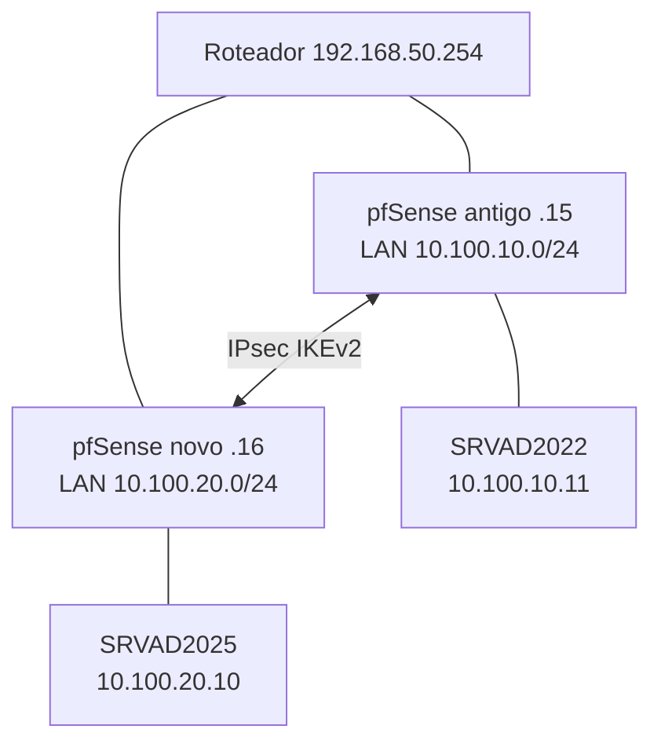

# Migração do Active Directory do VMware para Proxmox

Documentação *as code* da migração controlada do domínio `wcrpc.lan`, preservando o Microsoft Entra Connect e mantendo possibilidade de rollback.

> **Classificação:** repositório privado. Não armazenar senhas, PSKs, chaves, certificados, backups ou exports integrais de configuração.

## Objetivo

- Criar um controlador de domínio adicional no Proxmox.
- Validar AD DS, DNS, SYSVOL, replicação e autenticação antes de qualquer desativação.
- Manter o `SRVAD2022` e o Entra Connect operacionais durante a transição.
- Migrar a conectividade de forma controlada entre as redes antigas e novas.

## Situação atual

| Componente | Endereço | Estado |
|---|---:|---|
| Roteador físico | `192.168.50.254` | Operacional |
| Proxmox | `192.168.50.250` | Operacional |
| pfSense antigo | WAN `.15`, LAN `10.100.10.1/24` | Operacional |
| pfSense novo | WAN `.16`, LAN `10.100.20.1/24` | Operacional |
| SRVAD2022 | `10.100.10.11` | DC/DNS e Entra Connect |
| SRVAD2025 | `10.100.20.10` | Membro do domínio; promoção pendente |
| IPsec | LAN10 ↔ LAN20 | Estabelecido |
| Zabbix Agent 2 | SRVAD2025 | Instalado e ativo |

## Arquitetura transitória

## Documentação

- [Visão geral](docs/01-visao-geral.md)
- [Inventário](docs/02-inventario.md)
- [AD e Entra Connect](docs/03-ad-entra-connect.md)
- [Proxmox e VMs](docs/04-proxmox-vms.md)
- [Rede, pfSense e IPsec](docs/05-rede-ipsec.md)
- [Windows Server 2025](docs/06-windows-server-2025.md)
- [Zabbix](docs/07-zabbix.md)
- [Validações](docs/08-validacoes.md)
- [Rollback](docs/09-rollback.md)
- [Próximos passos](docs/10-proximos-passos.md)

## Decisões técnicas

- [ADR-001: novo DC em vez de P2V](decisions/ADR-001-novo-dc-em-vez-de-p2v.md)
- [ADR-002: LAN isolada no vmbr10](decisions/ADR-002-lan-isolada-vmbr10.md)
- [ADR-003: IPsec entre pfSense](decisions/ADR-003-ipsec-entre-pfsense.md)
- [ADR-004: Zabbix Agent 2 ativo](decisions/ADR-004-zabbix-agent2-ativo.md)

## Regra de mudança

Cada etapa deve ter: pré-requisitos, execução, evidências, critério de sucesso e rollback. Alterações destrutivas só acontecem depois de validação e backup.

